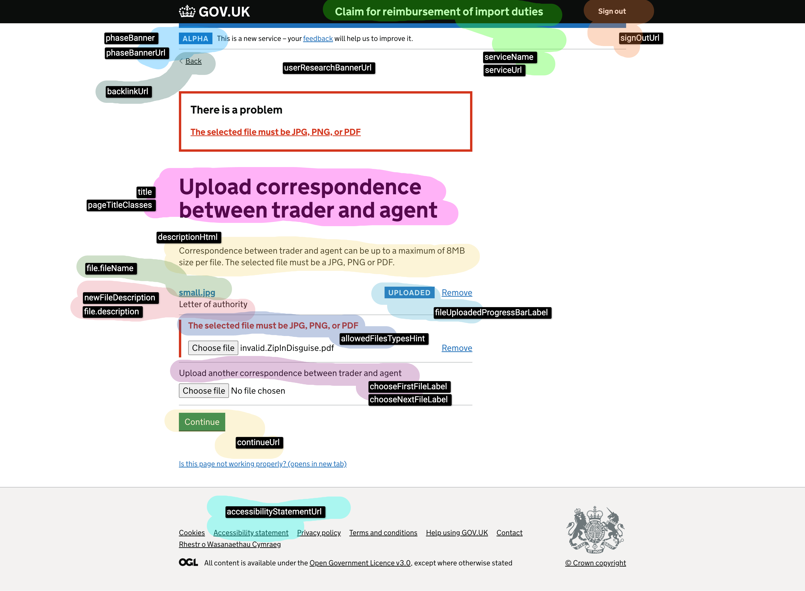
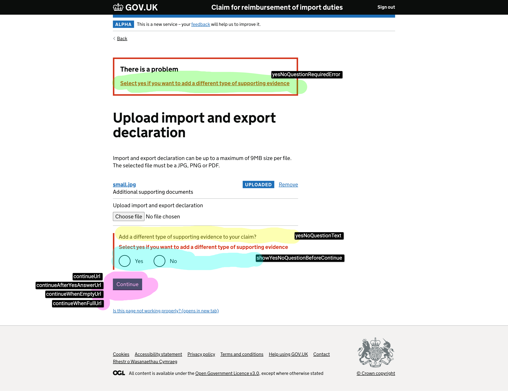

  

# upload-customs-documents-frontend

Plug&Play customizable frontend microservice for uploading customs documents to Upscan.

File upload session is attached to the initial Session-ID and defined by the latest initialization request, making it fully parametrizable and customizable by the invoking host service.

- [Integration guide](#integration-guide)
    - [Step-by-step](#step-by-step)
    - [Callback schema](#callback-payload-schema)
    - [File metadata](#file-metadata-schema)
    - [Session configuration](#upload-session-configuration-schema)
    - [Session content customization](#upload-session-content-customization-schema)
    - [Session features customization](#upload-session-features-schema)
    - [I18n of the content](#internationalization)
- [Sequence diagrams](#sequence-diagrams)
- [API](#api)
    - [/initialize](#post-initialize)
    - [/wipe-out](#post-wipe-out)
- [Design gallery](#design-gallery)
- [Development](#development)

## Features:
- UI to upload multiple files on a single page
- Non-JS UI version for uploading one file per page
- Per-host per-session customization

## Glossary

- **UDF**: upload-customs-documents-frontend service/journey
- **Host**, **Host service**: some frontend microservice integrating with upload-customs-documents-frontend and calling /initialize endpoint
- **Upscan**: dedicated MDTP subsystem responsible for hosting and verifying uploaded files

## Integration guide

An example implementation of the UDF integration can be found in the CDS-R service:
- Connector: https://github.com/hmrc/cds-reimbursement-claim-frontend/blob/main/app/uk/gov/hmrc/cdsreimbursementclaimfrontend/connectors/UploadDocumentsConnector.scala
- Controller: https://github.com/hmrc/cds-reimbursement-claim-frontend/blob/main/app/uk/gov/hmrc/cdsreimbursementclaimfrontend/controllers/rejectedgoodssingle/UploadFilesController.scala

### Prerequisites
- configuration of the Upscan services profile for the host microservice

### Step-by-step

1. implement a backchannel connector to the UDF calling [`https://upload-customs-documents-frontend.public.mdtp/internal/initialize`](#api-initialize) endpoint,

2. implement an authenticated backchannel `+nocsrf POST` endpoint for receiving [`UploadedFilesCallbackPayload`](#callback-payload); this will be pushed to the host service every time new file is uploaded or existing removed; UDF will take care of sending proper `Authorization` and `X-Session-ID` headers with the request,

3. use connector (1) each time before you navigate the user to the upload page, send a config and optionally a list of already uploaded files, use returned `Location` header to redirect user to the upload page URL,

4. call [`https://upload-customs-documents-frontend.public.mdtp/internal/wipe-out`](#api-wipe-out) endpoint when you no longer need upload session data, ideally after successful conclusion of the host journey.

Locally you should use `http://localhost:10110` instead of `https://upload-customs-documents-frontend.public.mdtp`.

<a name="callback-payload"></a>
### Callback payload schema

|field|type|required|description|
|-----|----|--------|-----------|
|`nonce`|number|required|Unique integer known only to the host session, should be used to cross-check that the request is genuine|
|`uploadedFiles`|array|required|Up-to-date collection of uploaded [FileMetadata](#filemetadata)|
|`cargo`|any|optional|An opaque JSON carried from and to the host service|

<a name="filemetadata"></a>
### File metadata schema

|field|type|required|description|
|-----|----|--------|-----------|
|`upscanReference`|string|required|Unique upscan upload reference|
|`downloadUrl`|string|required|An URL of a successfully validated file, should not be shared with user|
|`uploadTimestamp`|string|required|Upload date-time in a ISO-8601 calendar system, e.g. 2007-12-03T10:15:30+01:00 Europe/Paris |
|`checksum`|string|required|Uploaded file checksum|
|`fileName`|string|required|Uploaded file name|
|`fileMimeType`|string|required|Uploaded file MIME type|
|`fileSize`|number|required|Uploaded file size in bytes|
|`cargo`|any|optional|An opaque JSON carried from and to the host service|
|`description`|string|optional|File description in the limited HMTL format allowing use of `b`, `em`, `i`, `strong`, `u`, `span` tags only|
|`previewUrl`|string|optional|An MDTP URL of the file preview endpoint, safe to show, valid only insider the upload session |

### Internationalization

The service comes with built-in English and Welsh messages, and an optional language switch link.

All messages supplied in the initialization request must come in the proper variant as they will be displayed as-is.

## Sequence diagrams


## API

<a name="api-initialize"></a>
### POST /initialize

An internal endpoint to initialize upload session. Might be invoked multiple times in the same session.

Location: `https://upload-customs-documents-frontend.public.mdtp/internal/initialize` or `http://localhost:10110/internal/initialize`

Requires an `Authorization` and `X-Session-ID` headers, usually supplied transparently by the `HeaderCarrier`.

|response|description|
|:----:|-----------|
|201   | Success with `Location` header pointing to the right upload page URL |
|400   | Invalid payload |
|403   | Unauthorized request |

Minimal payload example:
```
    {
        "config":{
            "nonce": 12345,
            "continueUrl":"https://www.tax.service.gov.uk/my-service/page-after-upload",
            "callbackUrl":"https://my-service.public.mdtp/my-service/receive-file-uploads"
        }
    }
```

**IMPORTANT**

- `continueUrl` and optional `backlinkUrl` MUST be absolute URLs in `localhost` or `*.gov.uk` domain,
- `callbackUrl` MUST be an absolute URL in the `localhost` or `*.mdtp` domain

<a name="api-initialize-payload"></a>
#### Initialization payload schema

|field|type|required|description|
|-----|----|--------|-----------|
|[`config`](#api-initialize-payload-config)|object|required|Upload session configuration|
|`existingFiles`|array|optional|Initial collection of already uploaded [FileMetadata](#filemetadata)|

<a name="api-initialize-payload-config"></a>
#### Upload session configuration schema:

|field|type|required|description|
|-----|----|--------|-----------|
|`nonce`|number|required|Unique integer known only to the host session|
|`continueUrl`|string|required|A host URL where to proceed after user clicks `Continue` button|
|`callbackUrl`|string|required|A host URL where to push a callback with the uploaded files metadata|
|`continueAfterYesAnswerUrl`|string|optional|A host URL where to redirect after user selects `Yes`, defaults to `backlinkUrl`.|
|`continueWhenFullUrl`|string|optional|A host URL where to proceed after user clicks `Continue` (or selects `No` in the form) and there are no more file slots left, defaults to `continueUrl`|
|`continueWhenEmptyUrl`|string|optional|A host URL where to proceed after user clicks `Continue` (or selects `No` in the form) and none file has been uploaded yet, defaults to `continueUrl`|
|`backlinkUrl`|string|optional|A host URL where to retreat when user clicks backlink, otherwise a default `history.back()` action.|
|`sendoffUrl`|string|optional|A host URL where to send off the user if the current session has been deactivated (wiped out), defaults to `content.serviceUrl` or `http://www.gov.uk` if missing.|
|`minimumNumberOfFiles`|number|optional|Minimum number of files user can upload, usually 0 or 1, defaults to 1|
|`maximumNumberOfFiles`|number|optional|Maximum number of files user can upload, defaults to 10|
|`initialNumberOfEmptyRows`|number|optional|Initial number of empty choose file rows, defaults to 3|
|`maximumFileSizeBytes`|number|optional|Maximum size in bytes of a single file user can upload, defaults to 10485760 (10MB)|
|`allowedContentTypes`|string|optional|A comma separated list of allowed MIME types of the file, defaults to `image/jpeg,image/png,application/pdf,text/plain`|
|`allowedFileExtensions`|string|optional|A comma separated list of allowed file extensions to be used in a browser file picker|
|`newFileDescription`|string|optional|Template of description of a new file in a limited HMTL format allowing use of `b`, `em`, `i`, `strong`, `u`, `span` tags only|
|`cargo`|any|optional|An opaque JSON carried from and to the host service|
|[`content`](#api-initialize-payload-config-content)|object|optional|Content customization|
|[`features`](#api-initialize-payload-config-features)|object|optional|Features customization|

<a name="api-initialize-payload-config-content"></a>
#### Upload session content customization schema:




*All fields listed in the table are **optional**.*

|field|type|description|
|-----|----|-----------|
|`serviceName`|string|Service name to display in the header bar and title|
|`title`|string|Upload page title. Can be formatted using `span` or `abbr` HTML tags with `class`, `title`, `id` attributes if needed|
|`descriptionHtml`|string|Description in an HTML subset format allowing **only** use of`div`, `p`, `span`, `abbr`, `br`, `ol`, `ul`, `li`, `dd`, `dl`, `dt`, `i`, `b`, `em`, `strong`, `details`, `summary` tags and `class`, `title`, `id` attributes.|
|`serviceUrl`|string|Header bar URL pointing to the host service|
|`accessibilityStatementUrl`|string|Footer URL of  a host service accessibilty statement|
|`phaseBanner`|string|Phase banner type, either `alpha`, `beta` or none|
|`phaseBannerUrl`|string|An URL connected with phase banner|
|`userResearchBannerUrl`|string|An URL connected with user research banner, UDF will show the banner if present|
|`signOutUrl`|string|Custom sign out URL|
|`timedOutUrl`|string|Custom URL of a timed out page|
|`keepAliveUrl`|string|An URL where to send keep-alive beats|
|`timeoutSeconds`|number|Custom page timeout|
|`countdownSeconds`|number|Custom page countdown|
|`pageTitleClasses`|string|Customized page heading classes|
|`allowedFilesTypesHint`|string|A hint text to display for invalid uploads|
|`contactFrontendServiceId`|string|A `serviceId` for HmrcReportTechnicalIssue component|
|`fileUploadedProgressBarLabel`|string|Progress bar label displayed when file uploaded, defaults to `Ready to submit`|
|`chooseFirstFileLabel`|string|The label of the first file-input element. If files have descriptions then the label of the first file-input with description as defined in `newFileDescription`|
|`chooseNextFileLabel`|string|The label of each next file-input element|
|`addAnotherDocumentButtonText`|string|The text of the `Add Another Document` button, if enabled|
|`yesNoQuestionText`|string|optional|The text of the Yes/No question displayed before the `Continue` button if `showYesNoQuestionBeforeContinue` enabled. If the text starts with `h2.` then the question will be displayed as H2 header.|
|`yesNoQuestionRequiredError`|string|optional|The text of the error displayed when user didn't provide an answer to the Yes/No question|

<a name="api-initialize-payload-config-features"></a>
#### Upload session features schema:

*All fields listed in the table are **optional**.*

|field|type|description|default|
|-----|----|-----------|-------|
|`showUploadMultiple`|boolean|Whether to show choose multiple files or single file per page upload|`true`|
|`showLanguageSelection`|boolean|Whether to show language change link in the UDF|`true`|
|`showAddAnotherDocumentButton`|boolean|If `true` then shows `Add Another Document` on the /choose-files page. If `false` then instead automatically adds an empty file input row when needed|`false`|
|`showYesNoQuestionBeforeContinue`|boolean|If `true` then displays the **Yes**/**No** form before the `Continue` button. Selecting `Yes` will redirect to the `continueAfterYesAnswerUrl` or `backlinkUrl`. Selecting `No` will redirect to the `continueUrl`. Single file upload summary Yes/No form behaviour will be altered accordingly|`false`|

<a name="api-wipe-out"></a>
### POST /wipe-out

An internal endpoint to immediately remove upload session data, usually invoked at the end of an encompassing host journey. If not, session data will be removed anyway after the MongoDB cache timeout expires.

Location: `https://upload-customs-documents-frontend.public.mdtp/internal/wipe-out` or `http://localhost:10110/internal/wipe-out`

Requires an `Authorization` and `X-Session-ID` headers, usually supplied transparently by the `HeaderCarrier`.

|response|description|
|:----:|-----------|
|204   | Success |
|403   | Unauthorized request |

## Design gallery

#### Error messages summary


#### Upload files page with an initial single row
Next input rows will keep adding automatically up to the configured maximum number.


#### Upload files page with Yes/No question form
Yes/No form allows to steer user back to the file type selection or any other relevant page.


#### Upload files page with AddAnotherDocument button
Clicking on the button will add next input row up to the configured maximum number.


#### Upload files page with AddAnotherDocument button and Yes/No form
It is possible to have both button and the form. The page can be configured to show always more than a single input row.


#### Upload files page with different input row labels.
Each uploaded file can be marked with a label. Each empty input row can have a label. First and next empty rows can have different labels.


## Development

### Prerequisites

- JDK >= 1.8
- SBT 1.x (1.6.1)
- NODEJS 16.13.2

### Running the tests

    sbt test it:test

### Running the tests with coverage

    sbt clean coverageOn test it:test coverageReport

### Running the app locally

    sm --start UPLOAD_CUSTOMS_DOCUMENTS_ALL
    sm --stop UPLOAD_CUSTOMS_DOCUMENTS_FRONTEND 
    sbt run

It should then be listening on port 10110

    http://localhost:10110/upload-customs-documents

There is a Test Harness frontend which simplifies integration - you can access at:

    http://localhost:10111/upload-customs-documents-test-harness

The harness is also available in QA and Staging

## License


This code is open source software licensed under the [Apache 2.0 License]("http://www.apache.org/licenses/LICENSE-2.0.html")
